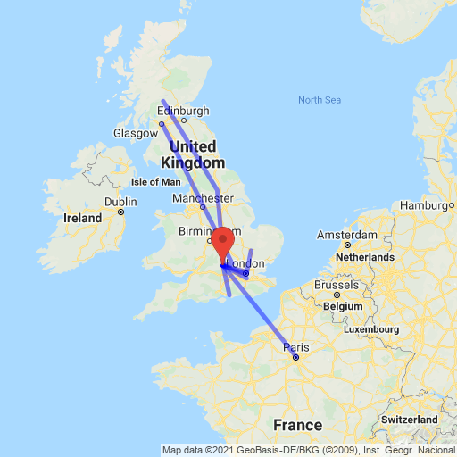

# and you may have some of my mail

In February 2021, I distributed 100 envelopes addressed to people all around the world. They had no postage. In a world that is
at once more and less connected than ever before, I hope to investigate the power of social bonds and spur unexpected coincidences.

As the envelopes travel from place to place, they will accumulate notes and drawings which the recipients will collate and share. **I have no 
idea how long these journeys will take.** They could take weeks - or years. Serendipity is beautiful and unpredictable.

This project was inspired by the work of [mail artist Ray Johnson](https://en.wikipedia.org/wiki/Ray_Johnson).

## Track the progress

Here's where they've gone so far.

## If you have an envelope

[Please log it](https://docs.google.com/forms/d/e/1FAIpQLScET7yQ-EsC9XcU9C10_-JEDKle6BauKJiz5RjW38yuDgBPwA/viewform) 
so that I can track it.

Then I ask that you -

- pass the envelope to someone else who will carry the envelope on
- add something two-dimensional and personally meaningful, like a sketch or a note, to the contents of the envelope, if you can

Please don't -

- send the envelope through the mail (unless you're sending a package anyway - in that case, feel free to slip it in)
- go more than fifteen minutes out of your way to deliver an envelope
- add anything bulky, dangerous, or illegal
- hold on to the envelope for long. Please try to keep it moving

## If you'd like an envelope or if you have questions

Get in touch. Use [this form](https://docs.google.com/forms/d/e/1FAIpQLSdCSW3-kNziG2o5c-NigaxLqENlqtUdQ3yq5ee4V0K974v7sQ/viewform) to contact me.
