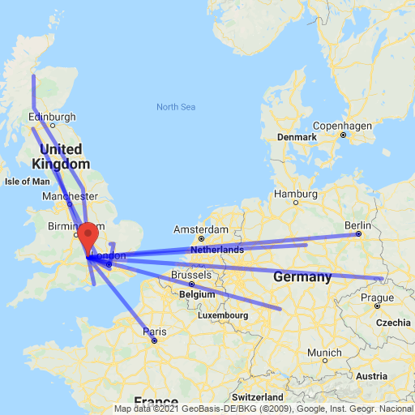

# and you may have some of my mail

In February 2021, our team distributed 100 envelopes addressed to people all around the world. They have no postage. In a world that is
at once more and less connected than ever before, we hope to show the power of social bonds and spur unexpected coincidences.

**We have no idea how long this will take.** It could take weeks. It could take years. Serendipity is beautiful and unpredictable.

## Track the progress

Here's where we've been so far.

## If you have an envelope

[Please log it](https://docs.google.com/forms/d/e/1FAIpQLScET7yQ-EsC9XcU9C10_-JEDKle6BauKJiz5RjW38yuDgBPwA/viewform) 
so that we can track it.

Then we ask that you -

- pass the envelope to someone else who will carry the envelope on
- add something two-dimensional and personally meaningful, like a sketch or a note, to the contents of the envelope, if you can

Please don't -

- send the envelope through the mail (unless you're sending a package anyway - in that case, feel free to slip it in)
- go more than fifteen minutes out of your way to deliver an envelope
- add anything bulky, dangerous, or illegal
- hold on to the envelope for long. Please try to keep it moving

## If you'd like an envelope or if you have questions

Get in touch. Use [this form](https://docs.google.com/forms/d/e/1FAIpQLSdCSW3-kNziG2o5c-NigaxLqENlqtUdQ3yq5ee4V0K974v7sQ/viewform) to contact us.
